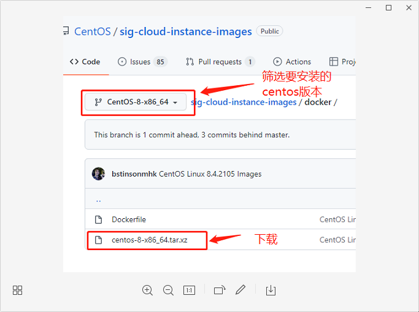

- [安装子系统](#安装子系统)
  - [1. 启动虚拟机功能](#1-启动虚拟机功能)
  - [2. 下载 Linux 内核更新包](#2-下载-linux-内核更新包)
  - [3. 将 wsl2 设置为默认版本](#3-将-wsl2-设置为默认版本)
  - [4.安装scoop、lxrunoffline](#4安装scooplxrunoffline)
  - [5. lxrunoffline 安装子系统（当然也可以到微软商店直接安装Ubuntu）](#5-lxrunoffline-安装子系统当然也可以到微软商店直接安装ubuntu)
  - [6.其他命令](#6其他命令)
- [更新源](#更新源)
  - [1. 方法一](#1-方法一)
  - [2. 方法二：手动更改三个文件](#2-方法二手动更改三个文件)
- [其他命令](#其他命令)
- [解决 wsl 无法使用systemctl 问题](#解决-wsl-无法使用systemctl-问题)
  - [1. 方法一： 安装genie](#1-方法一-安装genie)
  - [2. 方法二(没试过)](#2-方法二没试过)

----

## 安装子系统
### 1. 启动虚拟机功能
```
dism.exe /online /enable-feature /featurename:Microsoft-Windows-Subsystem-Linux /all /norestart
dism.exe /online /enable-feature /featurename:VirtualMachinePlatform /all /norestart
# 结束后最好重启系统， 
```
或者点击 `开始` 直接搜索`开启或关闭windows功能` 做如下勾选


### 2. 下载 Linux 内核更新包
*   [适用于 x64 计算机的 WSL2 Linux 内核更新包](https://wslstorestorage.blob.core.windows.net/wslblob/wsl_update_x64.msi)

> 备注：  ARM64 计算机，请下载 [ARM64 包](https://wslstorestorage.blob.core.windows.net/wslblob/wsl_update_arm64.msi)
> 必须在cmd中查询类型：systeminfo | find "系统类型"


### 3. 将 wsl2 设置为默认版本

** 以管理员的身份打开 PowerShell，、将 WSL 2 设置为默认版本：**
```shell
wsl --set-default-version 2

# 转换已安装的centos 为wsl2
wsl --set-version centos 2
```
### 4.安装scoop、lxrunoffline
[win10 软件资源包管理------scoop](https://www.jianshu.com/p/aa7fad6dd3ea)

```shell
scoop install lxrunoffline
```
### 5. lxrunoffline 安装子系统（当然也可以到微软商店直接安装Ubuntu）
**下载子系统： [centos](https://github.com/CentOS/sig-cloud-instance-images/tree/CentOS-8-x86_64/docker)**

```
# LxRunOffline install -n <子系统名称> -d <安装路径> -f <安装包>.tar.gz
LxRunOffline install -n centos-d D:/wsl/centos -f d:/wsl/backup/centos-8-x86_64.tar.xz
```
> 如果有安装 Windows Terminal 的话，下拉菜单会自动显示，不做过多描述

----

### 6.其他命令
```shell
# 查看安装的子系统
wsl -l -v

# 启用子系统
wsl -d centos

# 停用子系统（备份前需停用）
wsl -t centos

# 备份(备份完会生成一个.xml后缀的同名配置文件)
LxRunOffline e -n centos -f d:/wsl/backup/centos_backup.tar.gz
# [ERROR] The action/argument "export" doesn't support WSL2. 
# 如果出错可以转成wsl1 保存

# 恢复(读取备份时生成的同名配置文件并写入配置，或者-c参数指定配置文件。)
LxRunOffline i -n centos -d D:/wsl/centos -f d:/wsl/backup -f d:/wsl/backup/centos-8-x86_64.tar.xz
```

## 更新源
### 1. 方法一
```shell
# 备份源
mkdir repo_bak
mv /etc/yum.repos.d/*.repo repo_bak/
# 更新源 wget
wget -O /etc/yum.repos.d/CentOS-Base.repo https://mirrors.aliyun.com/repo/Centos-vault-8.5.2111.repo

# 或者 curl
curl -o /etc/yum.repos.d/CentOS-Base.repo https://mirrors.aliyun.com/repo/Centos-vault-8.5.2111.repo


yum clean all     # 清除系统所有的yum缓存
yum repolist
yum grouplist
yum makecache     # 生成yum缓存

```

### 2. 方法二：手动更改三个文件
> CentOS-Linux-AppStream.repo
> CentOS-Linux-BaseOS.repo
> CentOS-Linux-Extras.repo

**注释掉 mirrorlist=  替换baseurl**
1. 清华云镜像地址
`baseurl=https://mirrors.tuna.tsinghua.edu.cn/centos/$releasever/virt/$basearch/advanced-virtualization/`
2. 阿里云镜像地址
`baseurl=https://mirrors.aliyun.com/centos-vault//$contentdir/$releasever/AppStream/$basearch/os/`

## 其他命令
```shell
yum -y install sudo
yum -y install wget vim
yum -y net-tools 
dnf install langpacks-en glibc-all-langpacks -y # 安装命令语言包
# 中文支持
dnf install langpacks-zh_CN
echo 'LANG="zh_CN.UTF-8"' > /etc/locale.conf
echo 'LANG="zh_CN.UTF-8"' >> /etc/profile

yum install -y passwd # 用户密码管理

dnf -y install git
dnf -y install make
dnf -y install initscripts # 启用 service 命令

# window访问子系统文件
\\wsl$
# 子系统访问window文件
ls /mnt
```
## 解决 wsl 无法使用systemctl 问题
参考：hosinokoe's blog [博客repair-systemctl-in-CentOS8-on-WSL2](https://www.qiuzhi12.com/2021/10/25/repair-systemctl-in-CentOS8-on-WSL2/#/%E4%BF%AE%E5%A4%8Dsystemd)
### 1. 方法一： 安装genie
```shell

dnf install -y mock perl openssh-server # 安装依赖
# 下载安装包
dnf install -y epel-release wget 
wget https://github.com/arkane-systems/genie/releases/download/v1.44/genie-1.44-1.fc34.x86_64.rpm

dnf install -y genie-1.44-1.fc34.x86_64.rpm
genie -s
systemctl start mysql
vim ~/.bashrc # 添加自启动
```

```bashrc
if [ "`ps -eo pid,lstart,cmd | grep systemd | grep -v -e grep -e systemd- | sort -n -k2 | awk 'NR==1 { print $1 }'`" != "1" ]; then
  genie -s
fi
```
### 2. 方法二(没试过)
```shell
sudo dnf install python2 -y
sudo ln -s /usr/bin/python2 /usr/bin/python

sudo mv /usr/bin/systemctl /usr/bin/systemctl.old
curl https://raw.githubusercontent.com/gdraheim/docker-systemctl-replacement/master/files/docker/systemctl.py >temp
sudo mv temp /usr/bin/systemctl
sudo chmod +x /usr/bin/systemctl